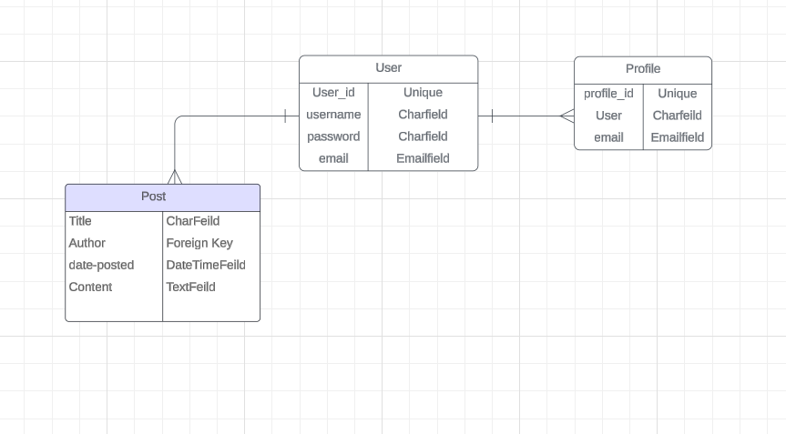
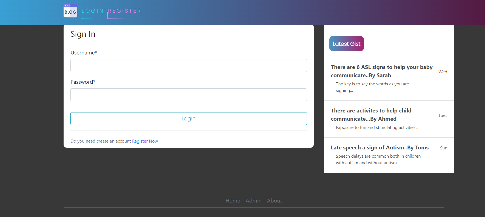
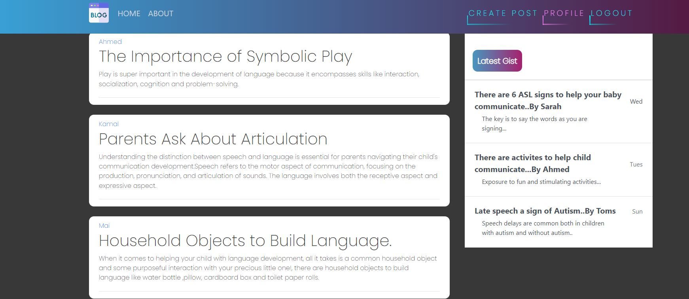
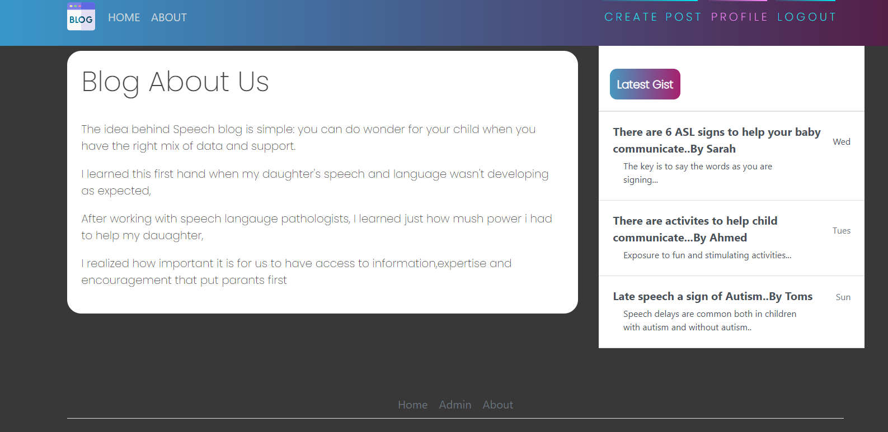
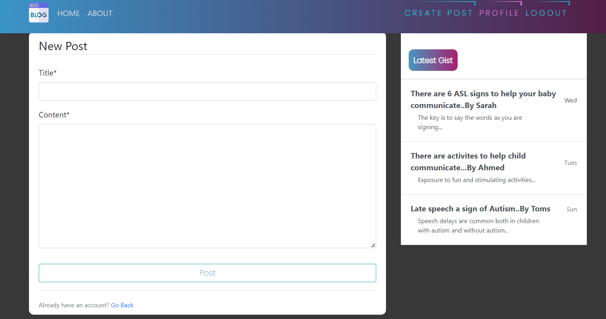
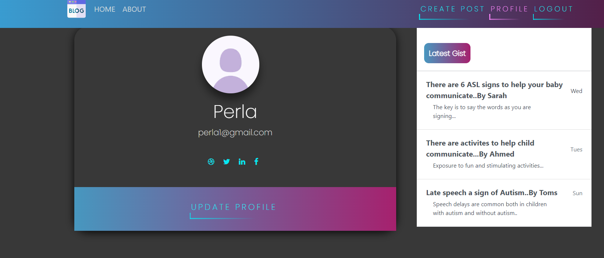
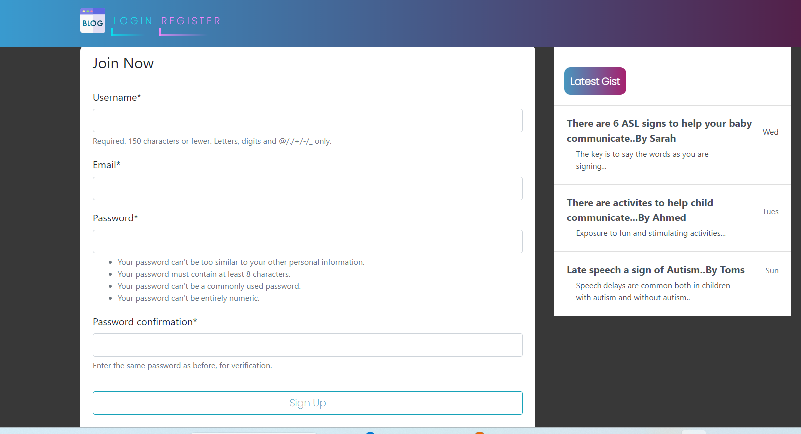
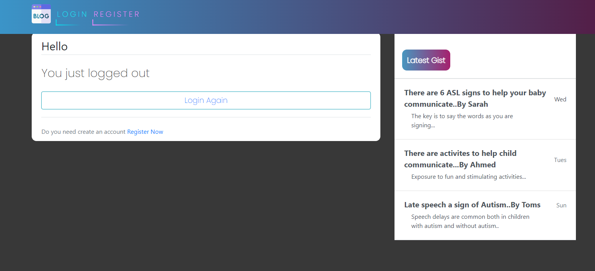
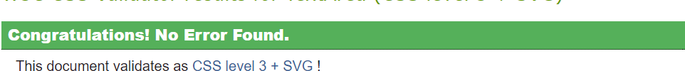

# **Speech Blog**
The idea behind Speech Blog is simple: you can do wonders for your child when you have the right mix of data and support.I learned this first hand when my daughter's speech and language wasn't developing as expected.After working with speech language pathologists, I realized how important it is for us to have access to information,expertise and encourgement that puts parents first.
With this idea, I created"Speech Blog"it is blog for parents to exhange ideas and informations to handle speech delay issue.

# Table of Content

* [**Project**](<#project>)
    * [Objective](<#objective>)
    * [Site Users Goal](<#site-users-goal>)
    * [Site Owner Goal](<#site-owner-goal>)
* [**User Experience (UX)**](<#user-experience-ux>)
    * [Wireframes](<#wireframes>)
    * [User Stories](<#user-stories>)
    * [Site Structure](<#site-structure>)
    * [Design Choices](<#design-choices>)

* [**Existing Features**](<#existing-features>)
    * [Navigation](<#navigation>)
    * [About](<#about>)
    * [Update / Delete Post](<#update-and-delete-post>)
    * [Create Post](<#create-post>)
    * [Profile Page](<#profile-page>)
    * [Sign Up](<#sign-up>)
    * [Log In](<#log-in>)
    * [Log Out](<#log-out>)
    * [Footer](<#footer>)
    * [Messages](<#messages>)

* [**Features Left To Implement**](<#features-left-to-implement>)

* [**Technologies Used**](<#technologies-used>)
    * [Languages](<#languages>)
    * [Frameworks](<#frameworks>)
    * [Libraries](<#libraries>)

* [**Testing**](<#testing>)
    * [Testing User Stories](<#testing-user-stories>)
    * [Code Validation](<#code-validation>)

* [Deployment](<#deployment>)
* [Credits](<#credits>)
* [Acknowledgments](<#acknowledgments>)

# **Project**

## Objective
I have decided to do Speech blog site that is as authentic and useful as possible. I also want to demonstrate my knowledge within the area of HTML,CSS,Javascript and Python.

## Site Users Goal
The user of ' Speech Blog ' to interact with other parants and shareing the informations and experiences about speech delay with each aother.

## Site Owners Goal
The goal of the site owner is to deliver a site where the users in an intuitive way can read about the latest informations and experiences.

### Database Schema
Lucidchart was used to create a database schema to visualise the type of post model the project requires. This schema was used as a guide to what needed to be add.It shows the relationship  between user, post , and profile.

# **User Experience (UX)**

## Wireframes
The wireframes for the site were created in the Balsamiq.It have been created for desktop,tablet and mobile devices.

## User Stories
Below the user stories for the project are listed to clarify why particular feature matters.

### Site User
|  |  |  |
|:-------:|:-------|:-------|
| As a Site User | I can view a list of posts so that I can select one to read | &check; |
| As a Site User | I can sign up an account so that I can create the post,create profile page and update them | &check; |
| As a Site User | I can create profile page so that reviewers can read about who I am | &check; |
| As a Site User | I can edit my post so that I can change the content if i needed | &check; |
| As a Site User | I can delete my post so that I have full control on my post | &check; |
| As a Site User | I can logout from the site so that I can feel safe that nobody can access my information | &check; |

### Site Admin
|  |  |  |
|:-------:|:-------|:-------|
| As a Site Admin | I can log out from the site so that I can feel safe that nobody can access my information | &check; |
| As a Site Admin | I can create ,read, update and delete reviews so that I can manage my review content | &check; |
| As a Site Admin | I can approve reviews so that I can secure high quality of the content | &check; |
| As a Site Admin | I can access an admin area so that I can get general understanding of loged in users and number of posts | &check; |

[Back to top](<#table-of-content>)

## Site Structure

The Speech Blog site is spilte in two parts:when the user is logout( see only register and login) and when user is logged in(see home,about,profile and posts).

## Design Choices

* ### Color Scheme
The color scheme chosen for ' Speech Blog' is cheerful to attract the users.

* ### Typography

# **Features**

## **Existing Features**

### **Navigation**
The navigation bar is very clean and straight forward. Depending if you are logged in or not different menus are visible for the site user.
* Links that are visible to logged out users *
* Register
* Login/sign up

* Links that are visible to logged in users:
* Home
* About
* Create post
* Profile
* Logout

### **About**
In about page the user can read the informations about the site.

### **Home**
In this page logged in users can see all posts.

### **Create Post**
In this page logged in user can create posts.

### **Updata And Delete Post**
The logged in user can update and delete his posts.

### **Profile Page**
On this page user can view and updata their own profile page.

### **Sign Up**
If the site vistor has no registered user at site.

### **Log Out**
When the user logout in the navbar.

### **Footer**
The footer area icludes (Home,Admin ,About).

### Features Left To Implement

* Add search option in the site.
* Add make comment in the users post.
* Add user's post in their profile page.
* Add images to user profile.

# Technologies Used

## Languages

* Python - provides the functionality for the site.
* HTML5 - provides the content and the structure for the website.
* CSS - provides the styling of the web site.
* Javascript - provides interactive elements of the website.

## Frameworks
* Bootstrap - a CSS franework that help building style for the site.
* Django - A model framework template framework used to create the site.
* Balsamiq - Used to create wireframe.
* Github - Used to host and edit website.
* Heroku - Acloud plateform that the application is deployed.
* Lighthouse - Used to test performance of the site.
* Responsive Desgin Checher - Used for test responsiveness.
* HTML validation - Used html validation.
* CSS validation - Used css validation.
* PEP8 validation - Used python validation

## Libraries
* Gunicorn
* Django Crispy Form

# Testing

## Testing User Stories

* As a Site User | I can view all the posts so that I can select one to read
   * At the top of the site there nav bar with link that lists all posts when user click on it.

* As a Site User | I can click on specific post so that I can read the whole post
   * At the home page  when the user click on on post it open to see it.

* As a Site User | I can sign up an account so that so that I can create,update and delete post, create profile and view other posts
   * In the navigation bar the user can click the login / sigin up for new account.when this is done the user can interact in site.

* As a Site User | I can create profile page so that I can put my information in site and update it
   * If the user is logged in there is profile page in navigaition bar where the user can fill profile detail and update it.

* As a Site User | I can create post so that I can contribute to with new post
   * When the user is logged in they can craete posts through the create button in navbar.

* As a Site User | I can log out from the site so that I can feel safe that nobody can access my information
   * When the user is logged in it possible to choose logout in naviagtion bar.

* As a Site Admin | I can logout out from the site so that I can feel safe that nobody can access my information
   * When the admin is logged in it is possible to logout.

* As a Site Admin | I can access admin area so that I can get a general understanding of logged in users and posts
   * In the admin area there is an summary area in top with general inaformation.

## Code Validation

### HTML validation
When validating my own code , there is no errors.

### CSS Validation
when validating my own code, there is no errors.

### Python Validation
When validating my own code, there is no errors

### Manual Testing

| Status | **Main Website - User Logged Out**
|:-------:|:-------|
| &check; | Pasting page that need authentication loads forbidden page
| &check; | Clicking login / register load sigin up and login page
| &check; | Typing in a incorrect URL on the page loads the 404 error page

| Status | **Main Website -User Logged In**
|:-------:|:-------|
| &check; | typing in a incorrect URl on the page load the 404 error page
| &check; | pasting page that need authentication loads forbidden page
| &check; | Clicking the nav home load the home page
| &check; | Clicking the nav about load the about page
| &check; | Clicking the nav create post load the create post page
| &check; | Clicking the nav profile load profile page
| &check; | Clicking the update button on post load update page
| &check; | Clicking the delete button on post load delete page

| Status | **Main Websit - Admin Logged In**
|:-------:|:-------|
| &check; | Total user show correct numbers of total user
| &check; | Total posts show correct numbers of posts

| Status | **Create Post - User Logged In**
|:-------:|:-------|
| &check; | Title field is required and not accept empty field
| &check; | Content field is required and not accept empty field

| Satuts | **Create New User - User Logged Out**
|:-------:|:-------|
| &check; | Username is required and not accept emty feild
| &check; | Eamil is required and not accept empty feild
| &check; | Password field don't accept empty feild
| &check; | Success message is displayed when the user submit user form

### Responsiveness Test
The site is responsive and it test in all devise.

### Browser Compatibilty
The site is work on Google Chrome, Mozilla Firefox, and Apple safari

### Lighthouse Report
The website was tested with Google Lighthouse

## Bugs

# Deployment
The site was deployed in heroku

## Deployment Preparation
Before deployment, the following steps were taken to prepare the application for the deployment on heroku:
- In the setting.py the Debuge was set to False.
- All the dependencies were stored in the requirment.txt.
- The start command for the application web gunicorn was stored in a Procfile.

## Setup
The steps to add the app to heroku are as follows:
- Create new app from the heroku dashboard.
- Enter a name of the app and select region, then click on create app.
- On the page of the app that open, go to setting tab.
- In setting add the necessary config var, I add collectaive static and database url.
- Next add the buildpack Heroku/Python.
- Afterwards go to the deploy tab on the app page.
- In the deployment method section, select GitHub and follow the steps to connect it with heroku.
- The last step is deploy branch manually by clicking the button Deploy Branch. 

# Credits

## Content

* All text content I took it from [Speech Therapy]()

## Technical

* I followed tutorial step by step in making the project[Tutorial]()
* Inspiration regarding css code to add animations and hue-rotate from [GeeksforGeeks]()
* Inspiration regarding crispy form and something in database from walk through project" Blog" by Code institute
* Inspiration regarding css code to make background gradient and svg [W3schools]()

# Acknowledgements
I would like to acknowledge the following people who have helped me along the way in completong my project:

* My husband, Tarek for all his support .
* My mentor, Precious for all his guidance and inspiration.
* My Kids for their support.

    